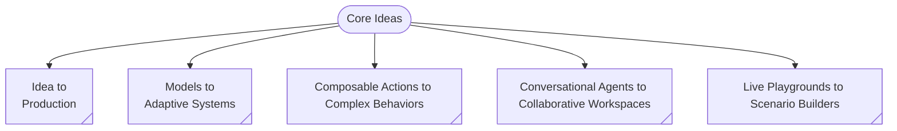

<div style="display: flex; flex-direction: column;">
    <table align="center">
        <tr>
            <td>
                
            </td>
            <td>
                <h1>⧊where (awhere)<sup>*</sup>: Agents Anywhere</h1>
                <p><em>An agentic platform for building agentic organizations.</em></p>
            </td>
        </tr>
        <tr>
            <td colspan="2">
                <sub>* ⧊where (awhere) is pronounced <i>aware</i> (uh-wehr).</sub>
            </td>
        </tr>
    </table>
</div>

<!--
Badges to be added here.
-->

⧊where is a platform for building agentic organizations—collaborative digital environments where intelligent agents and humans come together to iteratively build systems that transform creative ideas into measurable value outcomes.

The platform is born out of our firm belief in the role of _human beings as idea generators_ and the role of _organizations as playgrounds_ for implementation and experimentation of ideas generating value.

### Our Vision

We believe in the power of ideas and aim to help anyone turn ideas into reality—removing barriers to technical expertise through secure, verifiable, agent-based systems.

### Core Ideas



The core ideas of the ⧊where platform are:

1. **Idea to Production**: The ability to go from simple idea descriptions to production-ready systems.

   ```mermaid
   flowchart TB
    idea@{ shape: manual-input, label: "Input Ideas" }
    subgraph Awhere
        direction TB
        arun@{ shape: div-rect, label: "⧊where Runtime" }
        subgraph Generated
            direction TB
            description@{ shape: dbl-circ, label: "Descriptions" }
            specs@{ shape: docs, label: "Specifications" }
            code@{ shape: docs, label: "Codebase" }
            db@{ shape: docs, label: "Databases" }
            models@{ shape: lin-cyl, label: "Models" }
            subgraph Automation
                direction TB
                actions@{ shape: processes, label: "Actions" }
                tools@{ shape: processes, label: "Tools" }
                agents@{ shape: processes, label: "Agents" }
                workflows@{ shape: processes, label: "Workflows" }
                actions --o tools
                actions --o agents
                actions --o workflows
            end
            description --> specs
            code --> models
            specs --> models
            db --> models
            models --> Automation
        end
        subgraph Deployments
            direction TB
            playground@{ shape: hex, label: "Playground" }
            production@{ shape: hex, label: "Production" }
            playground -->|Publish| production
        end
        arun -->|Generate| Generated
        arun -->|Run| playground
    end
    idea eip@==> Awhere
    eip@{ animate: true }
   ```

2. **Models to Adaptive Systems**: Transforming static AI models into dynamic, self-improving systems that learn from interactions and adapt behavior based on context, feedback, and evolving requirements. These systems modify decision-making and optimize performance autonomously.
3. **Composable Actions to Complex Behaviors**: Build sophisticated capabilities by composing simple, reusable action primitives. Rather than monolithic behaviors, the platform enables combining atomic actions—such as data retrieval, transformation, validation, and communication—into emergent, complex workflows that adapt as requirements evolve.
4. **Live Playgrounds to Scenario Generation**: Turn interactive development environments into powerful scenario builders that generate realistic test cases, simulation environments, and what‑if analyses. This enables rapid experimentation and validation across diverse conditions before production deployment.
5. **Conversational Agents to Collaborative Workspaces**: Evolve simple chatbots into sophisticated collaborative environments where multiple agents and humans work together, sharing context, coordinating tasks, and building on each other’s contributions to achieve complex goals. These environments support rich interfaces and multiple modalities for effective problem‑solving with humans in the loop.

### High Level Approach

---

<span style="font-size:4pt; color: #666;">Copyright &copy; 2025 Weavers @ Eternal Loom. All rights reserved.</span>
