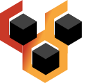

<table align="center">
<tr>
<td>

</td>
<td>
<h1>⧊where (awhere)*: Agents Anywhere</h1>

<em>an agentic platform for building agentic organizations</em>

</td>
</tr>
</table>
* ⧊where (awhere) is pronounced <i>aware</i> (uh-wehr).

<!--
Badges to be added here.
-->

⧊where is a platform for building agentic organizations—collaborative digital environments where intelligent agents and humans come together to iteratively build systems that transform creative ideas into measurable value outcomes.

The platform is born out of our firm belief in the role of _human beings as idea generators_ and the role of _organizations as playgrounds_ for implementation and experimentation of ideas generating value.

### Our Vision

We believe in the power of ideas, and we want to empower anyone to turn their ideas into reality—removing the barriers of access and availability of technical expertise through secure and verifiable agent based systems.

### Core Ideas

---

Copyright &copy; 2025 Weavers @ Eternal Loom. All rights reserved.
